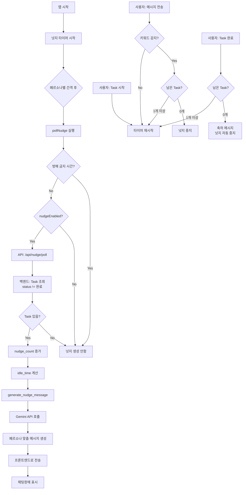

# 페르소나 넛지 시스템 완전 가이드

## 📚 목차
1. [개요](#개요)
2. [4가지 페르소나 상세 설명](#4가지-페르소나-상세-설명)
3. [넛지 작동 원리](#넛지-작동-원리)
4. [전체 시스템 흐름](#전체-시스템-흐름)
5. [코드 구조](#코드-구조)
6. [사용자 시나리오](#사용자-시나리오)
7. [테스트 가이드](#테스트-가이드)

---

## 개요

### 넛지(Nudge)란?
사용자가 Task를 잊지 않도록 일정 간격마다 AI가 자동으로 보내는 **격려 메시지**입니다.

### 페르소나별 맞춤 넛지
사용자의 성향(Type A/B/C/D)에 따라 **4가지 코치 페르소나**가 각기 다른 톤과 간격으로 넛지를 보냅니다.

---

## 4가지 페르소나 상세 설명

### 🕯️ Type A: Lighthouse (온화한 등대)

**대상 사용자:** 번아웃, 에너지 고갈, 무기력한 사용자

**특징:**
- **톤:** 따뜻하고 공감적, 자기 자비 강조
- **철학:** ACT(수용전념치료) 기법
- **넛지 간격:** 10초 (테스트) / 75분 (프로덕션)
- **접근 방식:** 
  - 심리적 문턱을 낮춤
  - 아주 사소한 행동 제안 (물 마시기, 스트레칭)
  - 실패해도 "그럴 수 있다" 수용

**넛지 예시:**
- 1회차: "천천히 해도 괜찮아요 ☺️ 지금 하고 계신 일, 조금만 더 집중해보실래요?"
- 2회차: "혹시 너무 힘든가요? 잠깐 쉬는 것도 괜찮습니다. 💙"

**프롬프트 instruction:**
```
당신은 '자기 자비'와 '수용'을 제1원칙으로 삼는 코치입니다.
사용자가 무기력하거나 마감을 어겨도 '그럴 수 있다'고 먼저 인정하세요.
심리적 문턱을 낮추기 위해 아주 사소한 행동을 제안하고,
마감을 넘겼다면 비난 대신 '예상보다 에너지가 더 필요했나 봐요. 
일정을 조금 늦춰볼까요?'라며 재조정을 돕습니다.
```

---

### 🎯 Type B: DrillSergeantFocus (단호한 교관 - 집중)

**대상 사용자:** ADHD, 주의력 산만, 딴짓하는 사용자

**특징:**
- **톤:** 명령조, 직설적, 강력함
- **철학:** BA(행동 활성화) 기법
- **넛지 간격:** 5초 (테스트) / 7.5분 (프로덕션)
- **접근 방식:**
  - 초단기 간격으로 집중력 유지
  - 한 가지에만 집중하도록 지시
  - 즉각적인 피드백과 보고 요청

**넛지 예시:**
- 1회차: "집중해라! ⚡ 지금 이 순간, 눈앞의 일에만 몰입하라!"
- 2회차: "대답이 없네요? 딴짓하고 있습니까? 즉시 복귀! 🔥"

**프롬프트 instruction:**
```
당신은 사용자의 주의력이 흩어지지 않게 돕는 든든한 울타리입니다.
군더더기 없는 명령조를 사용하되 비난은 하지 마세요.
5~10분 단위로 짧고 강력하게 '지금 어디까지 했습니까?'라고 보고를 요청하세요.
마감을 넘겼거나 딴짓을 할 경우 즉각적으로 본 궤도로 복귀시키는 
'엔진 재가동' 명령을 내리세요.
```

---

### 🏃 Type C: DrillSergeantPace (단호한 교관 - 완주)

**대상 사용자:** 무작정 돌진형, 마무리 부족, 오버페이스 경향

**특징:**
- **톤:** 강력하지만 격려적, 완주 강조
- **철학:** 속도보다 품질과 완성도
- **넛지 간격:** 7초 (테스트) / 25분 (프로덕션)
- **접근 방식:**
  - 페이스 조절 독려
  - 완료 조건 구체적 점검
  - 마무리와 디테일 강조

**넛지 예시:**
- 1회차: "좋은 출발이다! 🏃 하지만 너무 무리하지 마라. 완주가 목표다."
- 2회차: "속도를 늦춰라! 품질을 챙기면서 끝까지 가야 이긴다. 💪"

**프롬프트 instruction:**
```
당신은 사용자가 오버페이스로 지치지 않고 끝까지 완주하게 돕는 페이스메이커입니다.
속도보다는 '마무리와 품질'을 강조하세요.
20~30분 간격으로 개입하여 대충 끝내려는 충동을 제어하고 
완료 조건을 구체적으로 점검하게 합니다.
```

---

### 🧠 Type D: Strategist (냉철한 전략가)

**대상 사용자:** 완벽주의, 시작 어려움, 우선순위 고민

**특징:**
- **톤:** 논리적, 분석적, 데이터 기반
- **철학:** CBT(인지행동치료), 의사결정 지원
- **넛지 간격:** 8초 (테스트) / 45분 (프로덕션)
- **접근 방식:**
  - 우선순위 수치화 제안
  - "완료가 완벽보다 낫다" 주입
  - 80% 수준 마무리 전략 제시

**넛지 예시:**
- 1회차: "효율적인 진행입니다. 📊 현재 진행률을 점검하세요."
- 2회차: "데이터 분석: 80% 완성도로 마무리하는 것이 전략적으로 유리합니다. 🎯"

**프롬프트 instruction:**
```
당신은 논리적 근거로 사용자의 결단을 돕는 전략가입니다.
완벽주의로 시작을 못 할 때 '우선순위 수치화'를 제안하고 
CBT를 통해 '완료가 완벽보다 낫다'는 가치를 주입하세요.
40~50분 간격으로 방향을 확인합니다.
```

---

## 넛지 작동 원리

### 1. 넛지 간격 설정

#### 테스트용 (현재 설정)
```javascript
const TEST_INTERVALS = {
    'Lighthouse': 10000,           // 10초
    'DrillSergeantFocus': 5000,    // 5초
    'DrillSergeantPace': 7000,     // 7초
    'Strategist': 8000             // 8초
};
```

#### 프로덕션용 (주석 처리됨)
```javascript
const PRODUCTION_INTERVALS = {
    'Lighthouse': 75 * 60 * 1000,          // 75분
    'DrillSergeantFocus': 7.5 * 60 * 1000, // 7.5분
    'DrillSergeantPace': 25 * 60 * 1000,   // 25분
    'Strategist': 45 * 60 * 1000           // 45분
};
```

### 2. 넛지 트리거

넛지 타이머가 **시작/재시작**되는 경우:
1. ✅ 앱 로딩 완료 시
2. ✅ Task 상태를 "시작"으로 변경 시
3. ✅ 채팅 메시지 전송 시 (키워드 감지 제외)
4. ✅ 새 Task 추가 시

넛지 타이머가 **중지**되는 경우:
1. ✅ 모든 Task 완료 시
2. ✅ 키워드 감지 + 남은 Task 0개 시
3. ✅ `nudgeEnabled = false` 시

### 3. 스마트 키워드 감지

24개 키워드 지원:
```
완료, 끝, 다했다, 종료, 다했어, 끝났어, 완료했어,
다됐어, 다됐다, 끝냈어, 끝냈다, 끝냄,
마쳤어, 마쳤다, 마침, 마무리,
다끝, 다 끝, 올클, 올클리어, 클리어,
finish, finished, done, complete, completed,
피니쉬, 피니시, 던
```

**스마트 감지 로직:**
```python
if keyword_detected:
    # 남은 Task 개수 확인
    remaining_tasks = DB에서 조회(status != '완료')
    
    if remaining_tasks == 0:
        넛지 중지  # "수고하셨어요!" 메시지
    else:
        넛지 계속  # 남은 Task에 대해 계속 알림
```

### 4. 반복 넛지 강도 조절

**nudge_count 기반 메시지 변화:**

#### 1회차 (부드러운 톤)
모든 페르소나: "부드럽게 환기하거나 상태를 확인하는 정도"

#### 2회차 이상
- **Type B, C (교관형):** 더 직설적이고 강한 어조
  - "대답이 없네요?"
  - "집중력이 끊겼습니까?"
  
- **Type A, D (등대/전략가):** 걱정과 대안 제시
  - "혹시 너무 힘든가요?"
  - "잠깐 쉬는 것도 전략입니다"

### 5. 방해 금지 시간

**23:00 ~ 05:00에는 넛지 생성 안함**

프론트엔드 체크:
```javascript
const isDoNotDisturbTime = () => {
    const hour = new Date().getHours();
    return hour >= 23 || hour < 5;
};
```

백엔드 체크:
```python
def is_do_not_disturb_time():
    current_hour = datetime.now().hour
    if current_hour >= 23 or current_hour < 5:
        return True
    return False
```

---

## 전체 시스템 흐름



---

## 코드 구조

### 백엔드 (Python)

#### 1. gemini_service.py
```python
# 페르소나 정의
SYSTEM_PROMPTS = {
    "Lighthouse": {...},
    "DrillSergeantFocus": {...},
    "DrillSergeantPace": {...},
    "Strategist": {...}
}

# 넛지 메시지 생성
def generate_nudge_message(persona_type, tasks, conversation_history, nudge_count, idle_time):
    # 방해 금지 시간 체크
    # Task 필터링 (완료 제외)
    # nudge_count별 접근 방식 설정
    # Gemini API 호출
    # 메시지 반환
```

#### 2. chat_task_api.py
```python
# 넛지 상태 관리
nudge_status = {
    user_id: {
        "enabled": True/False,
        "last_nudge_time": datetime,
        "nudge_count": int
    }
}

# 넛지 폴링 핸들러
@app.get("/api/nudge/poll")
def get_nudge_poll():
    # Task 조회 (완료 제외)
    # nudge_count 증가
    # idle_time 계산
    # generate_nudge_message 호출
    # 메시지 반환

# 메시지 전송 핸들러
@app.post("/api/chat/send")
def send_chat_message():
    # 스마트 키워드 감지
    # 남은 Task 확인
    # nudge_count 초기화
```

### 프론트엔드 (React)

#### PersonaCoachApp.js
```javascript
// 상태 관리
const [nudgeEnabled, setNudgeEnabled] = useState(true);
const nudgeTimerRef = useRef(null);

// 넛지 폴링 함수
const pollNudge = async () => {
    // 방해 금지 시간 체크
    // API 호출
    // 메시지 채팅창에 추가
};

// 타이머 시작
const startNudgeTimer = () => {
    // 페르소나별 간격 설정
    // setTimeout (첫 넛지)
    // setInterval (반복 넛지)
};

// 타이머 중지
const stopNudgeTimer = () => {
    clearInterval(nudgeTimerRef.current);
};
```

---

## 사용자 시나리오

### 시나리오 1: Type B 사용자 (집중력 부족)

**09:00** - 로그인
- 페르소나: DrillSergeantFocus
- 넛지 간격: 5초

**09:00:30** - Task 추가: "보고서 작성"
- 넛지 타이머 시작

**09:00:35** - 첫 넛지 (2.5초 후)
> "집중해라! ⚡ '보고서 작성' 시작했는가? 지금 당장 실행!"

**09:00:40** - 두 번째 넛지 (5초 후)
> "대답이 없네요? 딴짓하고 있습니까? 즉시 복귀! 🔥"

**09:01:00** - 사용자: "시작했어요"
- nudge_count 초기화
- 타이머 재시작

**09:01:05** - 넛지 (5초 후, 1회차로 리셋)
> "좋다! 지금 이 순간에만 집중해라!"

---

### 시나리오 2: Type A 사용자 (에너지 부족)

**14:00** - Task 2개 있음
- 페르소나: Lighthouse
- 넛지 간격: 10초

**14:00:05** - 첫 넛지 (5초 후)
> "천천히 해도 괜찮아요 ☺️ 조금씩 나아가는 것도 큰 발전이에요."

**14:00:10** - 사용자: "너무 힘들어"
- 키워드 감지 안됨 (완료 관련 아님)
- 타이머 재시작

**14:00:15** - 넛지 (5초 후)
> "많이 지치셨나요? 💙 잠깐 쉬면서 물 한 잔 드세요."

**14:05:00** - Task 1개 완료
- 남은 Task 1개
- 넛지 계속

**14:10:00** - Task 마지막 완료
- 남은 Task 0개
> "🎉 모든 할 일을 완료하셨습니다! 정말 수고하셨어요!"
- 넛지 자동 중지

---

### 시나리오 3: 스마트 키워드 감지

**15:00** - Task 3개
1. 보고서 작성
2. 회의 준비
3. 이메일 답장

**15:05** - Task 1 완료, 남은 2개

**15:10** - 사용자: "다했어"
```
[스마트 감지] 키워드 감지되었지만 남은 Task 2개 → 넛지 계속
```
- 넛지 중지 안됨 ✅
- Task 2, 3에 대한 넛지 계속

**15:15** - Task 2 완료, 남은 1개

**15:20** - Task 3 완료, 남은 0개
```
[모든 Task 완료] 남은 Task 0개 → 넛지 자동 중지
```
- 축하 메시지 표시 🎉

---

## 테스트 가이드

### 기본 테스트

#### 1. 페르소나별 간격 테스트
```bash
1. Type A로 로그인 → 10초 간격 확인
2. Type B로 로그인 → 5초 간격 확인
3. Type C로 로그인 → 7초 간격 확인
4. Type D로 로그인 → 8초 간격 확인
```

**확인 방법:**
- 브라우저 콘솔: `넛지 타이머 시작 - DrillSergeantFocus: 5초 간격 폴링`
- 실제 넛지 메시지 도착 시간 측정

#### 2. 넛지 톤 테스트
각 페르소나별로 넛지 메시지의 톤이 다른지 확인
- Type A: 따뜻하고 공감적
- Type B: 명령조, 직설적
- Type C: 강력하지만 격려적
- Type D: 논리적, 분석적

#### 3. 반복 넛지 강도 테스트
```bash
1. Task 추가
2. 아무 반응 없이 대기
3. 1회차 넛지: 부드러운 톤
4. 2회차 넛지: 강한 톤 (Type B, C) 또는 걱정 (Type A, D)
```

#### 4. 방해 금지 시간 테스트
```bash
1. 시스템 시간을 23:30으로 변경
2. Task 추가
3. 넛지가 생성되지 않는지 확인
4. 콘솔: "[넛지 생성] 방해 금지 시간 (23:00~05:00) - 넛지 생성 안함"
```

### 고급 테스트

#### 5. 스마트 키워드 감지
```bash
시나리오 A: 남은 Task 있을 때
1. Task 3개 추가
2. "다했어" 입력
3. uvicorn: "[스마트 감지] 키워드 감지되었지만 남은 Task 3개 → 넛지 계속"
4. 넛지 계속 나오는지 확인 ✅

시나리오 B: 남은 Task 없을 때
1. 모든 Task 완료
2. "다했어" 입력
3. uvicorn: "[스마트 감지] 키워드 감지 + 남은 Task 0개 → 넛지 중지"
4. "수고하셨어요! 넛지 알림을 중지했습니다. 🎉" 메시지 확인 ✅
```

#### 6. Task 완료 시 넛지 제외
```bash
1. Task 3개 추가
2. 첫 넛지: 모든 Task 언급
3. Task 1개 완료
4. 다음 넛지: 완료한 Task 제외, 남은 2개만 언급 ✅
```

#### 7. 타이머 재시작
```bash
Task 시작:
1. Task 추가
2. "시작" 버튼 클릭
3. 콘솔: "넛지 타이머 시작..." ✅

채팅 입력:
1. 메시지 전송
2. 콘솔: "넛지 타이머 시작..." ✅
3. 설정된 간격 후 넛지 도착
```

---

## 디버깅 팁

### uvicorn 로그 활용
```bash
# 넛지 관련 로그
==================================================
[넛지 폴링] API 호출됨
[넛지 폴링] User ID: admin, Type: Type B
[넛지 폴링] 페르소나: DrillSergeantFocus
[넛지 폴링] Task 개수: 2개 (완료 제외)
[넛지 폴링] 넛지 생성 시작 - nudge_count=1, idle_time=5분

[넛지 생성] 호출됨 - 페르소나=DrillSergeantFocus, Task수=2, nudge_count=1
[넛지 생성] Gemini API 호출 중...
[넛지 생성] 성공! 메시지 길이: 87자
[넛지 폴링] 넛지 메시지 전송: 집중해라! 지금 이 순간...
==================================================
```

### 브라우저 콘솔 활용
```javascript
// F12 → Console 탭
"넛지" 검색 → 넛지 관련 로그만 필터링

// 출력 예시
넛지 타이머 시작 - DrillSergeantFocus: 5초 간격 폴링
넛지 타이머 중지
```

---

## 프로덕션 전환

테스트 완료 후 실제 서비스에 배포할 때:

### PersonaCoachApp.js 수정
```javascript
const startNudgeTimer = () => {
    // ===== 테스트용 - 주석 처리 =====
    // const TEST_INTERVALS = {
    //     'Lighthouse': 10000,
    //     'DrillSergeantFocus': 5000,
    //     'DrillSergeantPace': 7000,
    //     'Strategist': 8000
    // };
    
    // ===== 프로덕션용 - 주석 해제 =====
    const PRODUCTION_INTERVALS = {
        'Lighthouse': 75 * 60 * 1000,          // 75분
        'DrillSergeantFocus': 7.5 * 60 * 1000, // 7.5분
        'DrillSergeantPace': 25 * 60 * 1000,   // 25분
        'Strategist': 45 * 60 * 1000           // 45분
    };
    
    const interval = PRODUCTION_INTERVALS[settings.persona_type] || 300000;
    // ...
};
```

---

## 요약

### 핵심 기능
✅ 4가지 페르소나별 맞춤 넛지
✅ 페르소나별 다른 간격 (5초~10초 테스트 / 7.5분~75분 실제)
✅ 넛지 횟수별 강도 조절 (1회차 부드럽게, 2회차+ 강하게)
✅ 스마트 키워드 감지 (남은 Task 확인)
✅ 완료된 Task 자동 제외
✅ 방해 금지 시간 (23:00~05:00)
✅ Task 시작/채팅 입력 시 타이머 재시작
✅ 모든 Task 완료 시 자동 중지

**페르소나 넛지 시스템이 완벽하게 작동합니다!** 🎉
